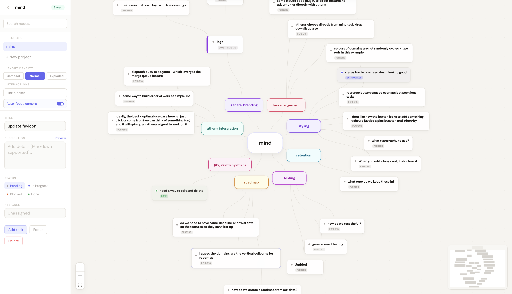

# mind

radial mind-mapping for projects — web UI + terminal tree viewer

## install

```bash
go install ./cmd/mind
```

## usage

```bash
mind              # tree view of all projects
mind tree sre     # tree view of a specific project
mind ui           # launch the web UI
```

```
SRE
├─ ◆ Logging — Centralized logging infrastructure
│  ├─ ● Log aggregation                          done
│  ├─ ● Structured logging                       in_progress  @drew
│  └─ ○ Log retention policy
├─ ◆ Monitoring — Metrics and observability
│  ├─ ● Deploy Prometheus                        done
│  ├─ ● Grafana dashboards                       in_progress  @drew
│  └─ ○ SLO tracking                             blocked  ⊘ blocked by: Deploy Prometheus
└─ ◆ Alerting — Incident detection and notification
   ├─ ○ PagerDuty integration
   ├─ ○ Alert rules                              ⊘ blocked by: PagerDuty integration
   └─ ○ Write runbooks                           @drew  ⊘ blocked by: Alert rules
```

## vault

project data lives in `~/.mind/` — a git-backed vault that syncs across machines.

```bash
mind vault init              # git init the vault
mind vault init --github     # + create private repo on GitHub
mind vault init --gitlab     # + create private repo on GitLab
mind vault sync              # commit + pull + push
mind vault status            # show vault state
```

## data model

each project is a JSON file in `~/.mind/`. nodes form a hierarchy: **root** → **domain** → **feature** → **task**. features and tasks carry status (`pending`, `in_progress`, `blocked`, `done`) and optional assignees. edges can be `hierarchy` (parent-child) or `blocks` (blocking relationship).

## stack

- **ui**: react flow, zustand, tailwind, vite
- **cli**: go, cobra, lipgloss
- **data**: JSON files in `~/.mind/`

<br>

<p align="center">
  
</p>
